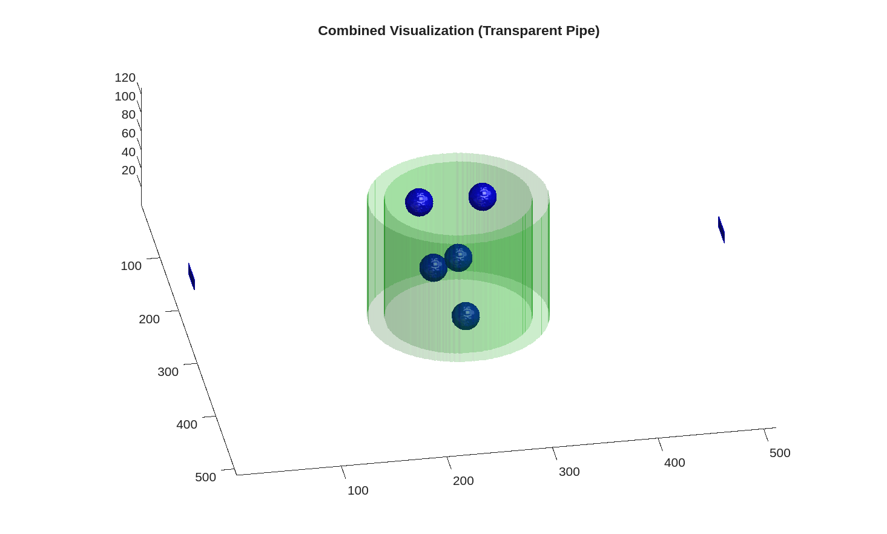

# kwavesource



## 概要

k-Wave を用いて、超音波と流体を含む実験セットアップを数値的に再現し、機械学習向けの高品質データセットを生成するシミュレーション基盤です。水中のパイプや粒子など、複雑な媒質中での超音波伝搬を模擬します。

## Getting Started

### Prerequisites

- MATLAB (recommended version: R2020a or later)
- Statistics and Machine Learning Toolbox  
  （例: mpm を用いたインストール）

  ```bash
  sudo ./mpm install \
    --release R2026b \
    --destination /usr/local/MATLAB/R2024b \
    --products "Statistics and Machine Learning Toolbox"
  ```

- [k-Wave Toolbox](https://www.k-wave.org/)  
  （例: k-Wave C++ バイナリに実行権限を付与）

  ```bash
  chmod +x /home/user/Matlab/k-Wave/binaries/kspaceFirstOrder-CUDA
  ```
- This repository (clone or download)
- (recommended) computer with gpus  
   to test these prerequisites, execute k-wave tutorial codes in `arcaiv/` dir  
   
### Directory Structure

- `config.json`: シミュレーションパラメータのメイン設定
- `tutorials/`: サンプルスクリプトとプロット
- `src/`: シミュレーションとデータ生成のソースコード
- `documents/`: ドキュメントと画像
- `location_seed/`: パイプや粒子位置のシードファイル

## ワークフロー

1. **パイプ・粒子位置の生成とサンプル入力の可視化**
   - `pipe_location_gen.m` で位置シードを生成し、同時に `sampleplot.m` で入力信号を可視化します。生成されたシードは `location_seed/` に保存されます。
   ```matlab
   % 例: 位置シード生成とサンプル信号プロット
   run('tutorials/pipe_location_gen.m')
   ```

2. **データ生成**
   - メインのデータ生成スクリプトが設定とシードを読み込み、シミュレーション領域を構築して数値計算を実行します。結果は指定ディレクトリに保存されます。
   - `config.json` から設定を自動読み込み
   - config で指定したフォルダから位置シードを読み込み
   - 圧力場やセンサーデータなどを保存（機械学習向けに利用可能）
   ```matlab
   % 例: データ生成の実行
   run('src/data_generation.m')
   ```
   - ディレクトリ構成を変更した場合は `config.json` のパスを更新してください。

## 注意事項
- 超音波の短時間スケールを想定し、流れはないものとしています。
- 粒子数やパイプ寸法などのパラメータは `config.json` で変更できます。
- 生成データセットは機械学習モデルの学習や検証に利用できます（関連リポジトリ: `ml-airlift`）。

## 参考
- [k-Wave Documentation](https://www.k-wave.org/documentation/)
- 追加の図や解説は `documents/` を参照してください。

## 連絡先
質問やコントリビューションは Issue を立てるか、メンテナに連絡してください。

